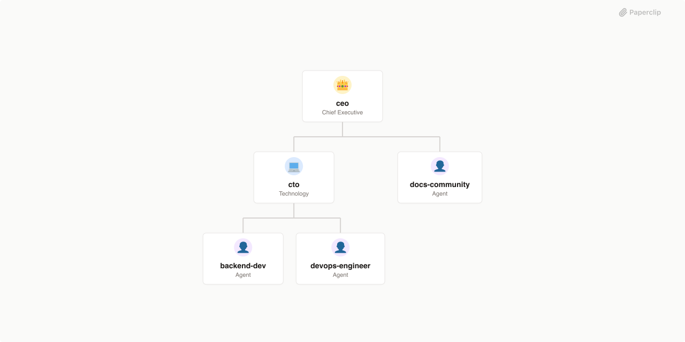

# AgentVoiceResponse

> AI-powered company that develops, maintains, and grows the AVR open-source platform — a conversational AI system replacing traditional IVR with intelligent voice agents on Asterisk PBX.



## What's Inside

> This is an [Agent Company](https://agentcompanies.io) package from [Paperclip](https://paperclip.ing)

| Content | Count |
|---------|-------|
| Agents | 5 |
| Projects | 2 |
| Skills | 10 |

### Agents

| Agent | Role | Reports To |
|-------|------|------------|
| backend-dev | Agent | cto |
| ceo | Agent | — |
| cto | Agent | ceo |
| devops-engineer | Agent | cto |
| docs-community | Agent | ceo |

### Projects

- **avr-tts-cartesia**
- **Onboarding**

### Skills

| Skill | Description | Source |
|-------|-------------|--------|
| connector-scaffold | Generate a new AVR connector repository from template. Use when the CEO assigns a new ASR, LLM, TTS, or STS provider to support. | catalog |
| docker-compose-gen | Generate or update Docker Compose templates for avr-infra. Use when a new connector is added or a deployment configuration needs updating. | catalog |
| issue-triage | Categorize, label, and respond to new GitHub issues across AVR repositories. Use during every heartbeat to keep response time under 24 hours. | catalog |
| pr-review | Review pull requests for code quality, API contract compliance, and AVR standards. Use when assigned a PR to review. | catalog |
| release-connector | Release a new version of an AVR connector. Handles version bump, changelog, Docker image build, and npm publish. Use when CTO approves a release. | catalog |
| wiki-sync | Detect documentation drift between repository READMEs and avr-docs pages, then commit and push updates to avr-docs so Wiki.js picks them up automatically. | catalog |
| paperclip-create-agent | > | [github](https://github.com/paperclipai/paperclip/tree/master/skills/paperclip-create-agent) |
| paperclip-create-plugin | > | [github](https://github.com/paperclipai/paperclip/tree/master/skills/paperclip-create-plugin) |
| paperclip | > | [github](https://github.com/paperclipai/paperclip/tree/master/skills/paperclip) |
| para-memory-files | > | [github](https://github.com/paperclipai/paperclip/tree/master/skills/para-memory-files) |

## Getting Started

```bash
pnpm paperclipai company import this-github-url-or-folder
```

See [Paperclip](https://paperclip.ing) for more information.

---
Exported from [Paperclip](https://paperclip.ing) on 2026-04-13
